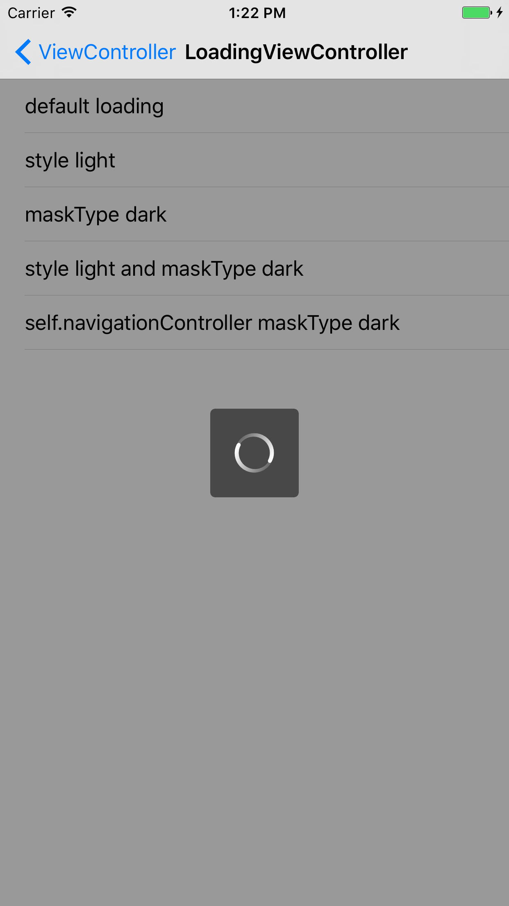

# ZBToastHUD

A simple and elegant HUD.

## Installation

### Manually

* Drag the `ZBToastHUD/ZBToastHUD/ZBToastHUD` folder into your project.
* Take care that `ZBToastHUD.bundle` is added to `Targets->Build Phases->Copy Bundle Resources`.

## Usage

See sample Xcode project in `/ZBToastHUD`.

### Showing the loading HUD

```
- (void)showLoading;
- (void)showLoadingWithMaskType:(ZBToastHUDLoadingMaskType)maskType;
```

### Dismissing the loading HUD

```
- (void)dismissLoading;
- (void)dismissLoadingWithCompletion:(ZBToastHUDLoadingDismissCompletion)completion;
- (void)dismissLoadingWithDelay:(NSTimeInterval)delay;
- (void)dismissLoadingWithDelay:(NSTimeInterval)delay completion:(ZBToastHUDLoadingDismissCompletion)completion;
```

### Showing the toast HUD

```
- (void)showWithMessage:(NSString *)message;
- (void)showNoNetwork;                                          
- (void)showSuccessWithMessage:(NSString *)message;         
- (void)showErrorWithMessage:(NSString *)message;           
- (void)showWarningWithMessage:(NSString *)message;             
- (void)showImage:(UIImage *)image message:(NSString *)message; 
```

### Dismissing the toast HUD

```
- (void)dismissToast;
```

## Hint

As standard `ZBToastHUD` offers two preconfigured styles:

* ZBToastHUDLoadingStyleDark: Black background with white spinner.
* ZBToastHUDLoadingStyleLight: Clear background with gray spinner.

## Screenshots

<p align="center">
&nbsp;
&nbsp;
&nbsp;
&nbsp;

</p>

<p align="center">
&nbsp;
&nbsp;
&nbsp;
&nbsp;

</p>


